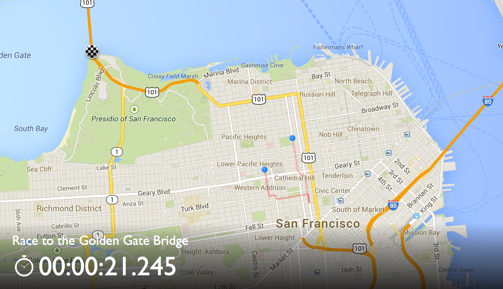

MapRacer
========

MapRacer is an idea for a game where you can compete against your friends in
finding the fastest way to a goal. Players play on their Android device and move
by navigating through StreetView imagery:

When connected to a Chromecast device, the game shows an overview map as well 
as the current leaderboard:

Google Cast Ready and the Google Cast Ready Badge are trademarks of Google Inc.
